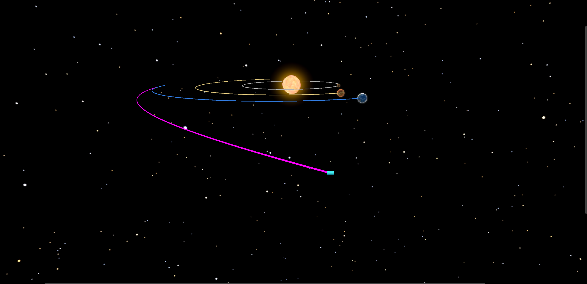
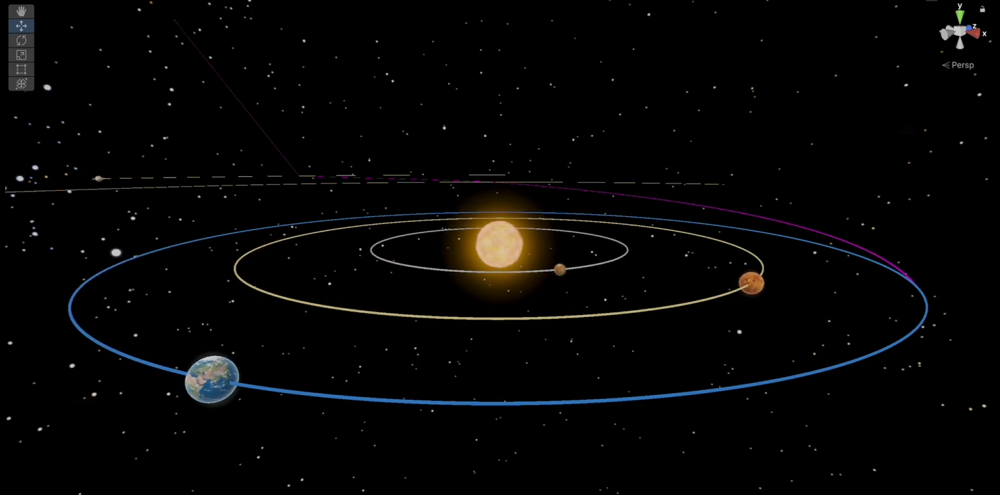

# Voyager 1 Solar System Simulation

A 3D simulation of Voyager 1's historic journey through the solar system, developed in Unity using real astronomical data.

## Overview

This project recreates Voyager 1's trajectory from launch through its encounters with Jupiter and Saturn, using accurate physics calculations and data-driven modeling. The simulation combines scientific accuracy with interactive 3D visualization to provide an educational representation of one of humanity's most significant space missions.

## Key Features

- **Realistic Physics**: Semi-implicit Euler integration with gravitational calculations
- **Accurate Planetary Data**: Real astronomical parameters loaded from JSON dataset
- **Dynamic Camera System**: Cinematic views following Voyager 1's journey
- **Interactive 3D Environment**: Explore the solar system and planetary encounters

## Technologies

- **Engine**: Unity
- **Language**: C#
- **Data Source**: JSON-based astronomical parameters
- **Graphics**: Procedural rendering with optimized shaders

## Mission Data vs Simulation Accuracy

| Parameter | Real | Simulated | Difference |
|-----------|------|-----------|------------|
| Launch Delta-V | ~17.0 km/s | 12.54 km/s | -26.2% |
| Jupiter Distance | 778M km | 778.57M km | +0.07% |
| Saturn Distance | 1.43B km | 1.433B km | +0.2% |
| Jupiter Approach Speed | ~19 km/s | 19.62 km/s | +3.3% |
| Jupiter Exit Speed | ~24 km/s | 24.81 km/s | +3.4% |
| Saturn Approach Speed | ~21 km/s | 21.52 km/s | +2.5% |
| Saturn Exit Speed | 21 km/s | 21.01 km/s | +0.05% |
| Jupiter Deflection | ~21 degrees | ~21.8 degrees | +3.8% |
| Saturn Deflection | ~35 degrees | 34.1 degrees | -2.6% |

The simulation achieves high accuracy with most parameters within 5% of real mission data, demonstrating effective physics modeling and trajectory calculations.

## Project Structure

- **Data Module**: JSON file with celestial body parameters
- **3D Assets**: Planetary models with realistic textures and skybox
- **Core Scripts (C#)**: The simulation's logic is handled through several custom scripts:
  - **Body.cs**: Initializes the physical and visual properties of planetary and solar bodies
  - **PhysicsIntegrator.cs**: Handles gravitational force computations and numerical integration using semi-implicit Euler method with sub-stepping for improved stability
  - **SimulationManager.cs**: Core controller that initializes the simulation, coordinates updates, and manages script interactions
  - **SolarSystem.cs**: Manages all celestial bodies, including loading planet data from JSON, spawning objects, and updating positions in real time
  - **VoyagerController.cs**: Simulates Voyager 1's trajectory, calculating launch conditions, velocity vectors, and deflection maneuvers for Jupiter and Saturn encounters
  - **UnitScale.cs**: Manages unit conversion between astronomical units and Unity's scaled coordinate system
  - **CameraFollow.cs & CameraDirector.cs**: Provide cinematic camera movement, following Voyager 1 dynamically through key mission phases

## Getting Started

1. Clone the repository
2. Open the project in Unity
3. Load the main scene
4. Press Play to start the simulation

---

*Developed as an educational demonstration of smart computer graphics techniques applied to space exploration.*
